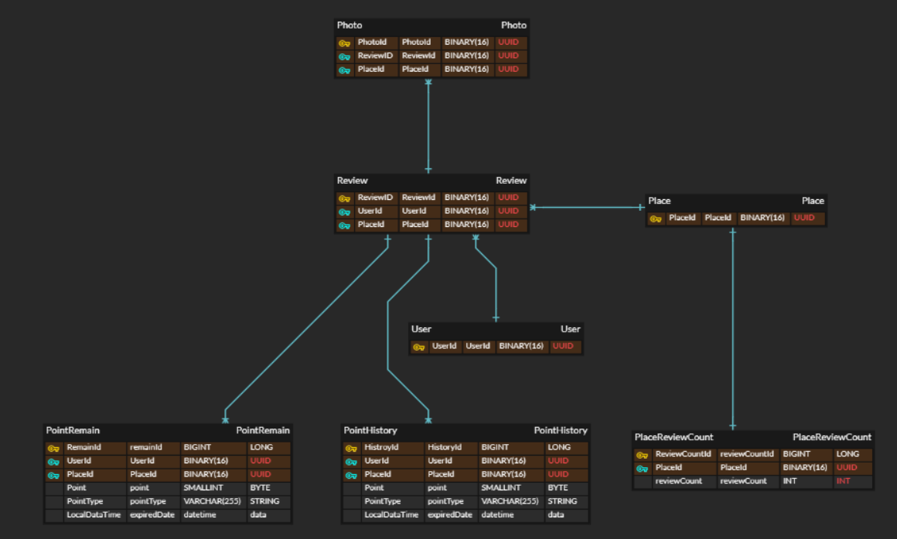

<<<<<<< Updated upstream
# Triple_BE_HOMEWORK
 트리플 BE 과제 입니다. 
=======
# Triple HomeWork
### 트리플여행자 마일리지 서비스 과제

#### Stack
- Java 11
- Gradle 7.1
- MySQL 5.7.34
- docker
- kafka

#### Run Application
` $ docker-compose up --build `

#### TEST API 
##### POST /events
```json
{
"type": "REVIEW",
"action": "ADD",
"reviewId": "240a0658-dc5f-4878-9381-ebb7b2667772",
"content": "좋아요!",
"attachedPhotoIds": [
"e4d1a64e-a531-46de-88d0-ff0ed70c0bb8",
"afb0cef2-851d-4a50-bb07-9cc15cbdc332"],
"userId": "3ede0ef2-92b7-4817-a5f3-0c575361f744",
"placeId": "2e4baf1c-5acb-4efb-a1af-eddada31b00f"

}
```
Place는 본래 저장이 되어있어야 API 처리가 성공적으로 가능 하지만 
테스트 편의 상 저장이 되어있지 않는 Place의 경우 요청 PlaceId로 reviewCount 정보를 만들어 주었습니다. 

##### GET /point/history/{userId} 
Response:
```json

{
    "header": {
    "code": 200,
    "message": "SUCCESS"
},
"body": {
    "data": 
        [
            {
            "point": 1,
            "pointType": "CONTENT",
            "placeId": "2e4baf1c-5acb-4efb-a1af-eddada31b00f"
            },
            {
            "point": 1,
            "pointType": "PHOTO",
            "placeId": "2e4baf1c-5acb-4efb-a1af-eddada31b00f"
            }
        ]
    }
}
```

##### GET /point/total/{userId}
Response:
```json

{
    "header": {
    "code": 200,
    "message": "SUCCESS"
},
"body": {
    "data": 
        "totalPoint" : 2
    }
}
```
## ERD 

`상기 Review , Photo , User , Place 의 관계는 이해를 돕기 위한 다이어 그램 입니다.`
`실제로 사용한 테이블은 PlaceReviewCount , PointHistory , PointRemain 테이블 입니다. `
`Place 테이블이 코드상에 존재 했다면 ReviewCount table 은 삭제되도 된다고 생각 됩니다. 실제로는 Place 테이블에 존재 가능한 속성이라고 생각 됩니다.`

## DDL
`JPA ORM을 사용하여 APP 실행시 자동으로 테이블이 생성 되어 참고용으로 봐주시면 되겠습니다.`
#### Review Count Table 
```sql
CREATE TABLE place_review_count
(
    review_count_id BIGINT     NOT NULL,
    created_by      BIGINT     NULL,
    updated_by      BIGINT     NULL,
    place_id        BINARY(16) NULL,
    review_count    INT        NULL,
    CONSTRAINT pk_placereviewcount PRIMARY KEY (review_count_id)
);

CREATE INDEX idx_place_id ON place_review_count (place_id);
```
#### point_history table
```sql
CREATE TABLE point_history
(
    history_id   BIGINT       NOT NULL,
    created_by   BIGINT       NULL,
    updated_by   BIGINT       NULL,
    point        SMALLINT     NULL,
    point_type   VARCHAR(255) NULL,
    user_id      BINARY(16)   NULL,
    place_id     BINARY(16)   NULL,
    expired_date datetime     NULL,
    CONSTRAINT pk_pointhistory PRIMARY KEY (history_id)
);

CREATE INDEX idx_user_id ON point_history (user_id);

CREATE INDEX idx_user_place_id ON point_history (user_id, place_id);
```
#### point_remain table
```sql
CREATE TABLE point_remain
(
    remain_id    BIGINT       NOT NULL,
    created_by   BIGINT       NULL,
    updated_by   BIGINT       NULL,
    point        SMALLINT     NULL,
    point_type   VARCHAR(255) NULL,
    user_id      BINARY(16)   NULL,
    place_id     BINARY(16)   NULL,
    history_id   BIGINT       NULL,
    expired_date datetime     NULL,
    CONSTRAINT pk_point_remain PRIMARY KEY (remain_id)
);

CREATE INDEX idx_user_id ON point_remain (user_id);
```
## 🏝 요구사항 분석
### 1. 문제 분석
`고민을 많이 했습니다. Review Event API 를 보니 Delete Event API
와 같은 경우 이미 삭제가 된 리뷰의 대한 정보에 대해 event 가 발생 한다는게 가장 큰 고민이였습니다.`
###### `포인트 HISTORY 를 만들기 위해서 INSERT 만 존재하는 테이블을 만들어야 했고`
##### `이러한 문제를 해결하기 위해서 현재 남아있는 기록과 전체 기록을 비교 하는 방법을 떠올렸습니다.`

## 🏝 구현 프로그램의 문제점
#### `대규모 서비스에서 비동기는 필수적이라 생각하여 비동기로 구현했습니다.`
#### `문제점은 다음과 같습니다. `
#### `비동기를 위해 Kafka를 이용하였는데 이럴 경우 consumer에게 일을 던져주고 return을 해 버리기 때문에 Client에서는 오류를 확인하기 어렵습니다.  `
#### `이러한 점은 로직에 문제가 없다는 가정하에  Kafka 는 중단 부분부터 재시작이 가능 합니다. `
#### `서버에 문제가 있더라도 서버가 재시작 되면서 이전에 요청한 작업의 경우는 Message que에 저장되기 때문에 작업의 신뢰성을 보장 할 수 있어서 크게 문제가없다고 생각 했습니다.`


>>>>>>> Stashed changes
